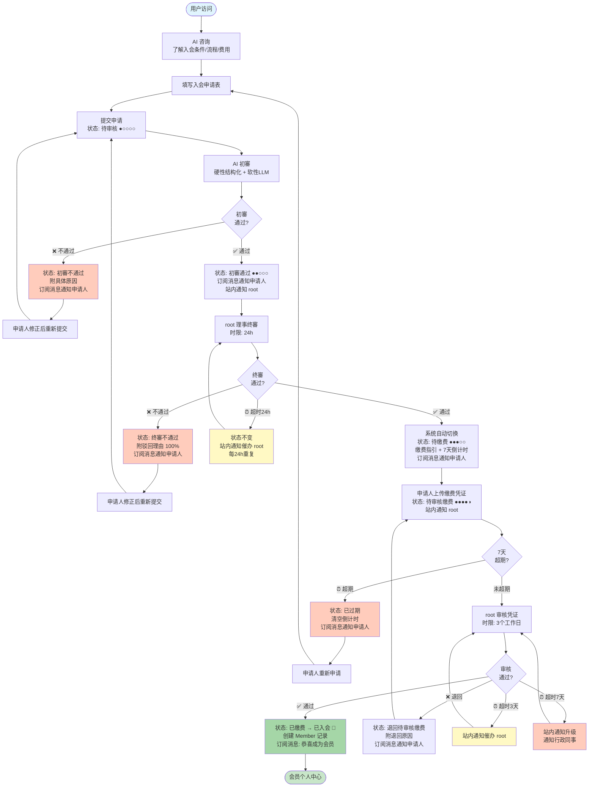

```mermaid
flowchart TD
    Start(["用户访问"]) --> Consult["AI 咨询<br/>了解入会条件/流程/费用"]
    Consult --> Fill["填写入会申请表"]
    Fill --> Submit["提交申请<br/>状态: 待审核 ●○○○○"]

    Submit --> Screening["AI 初審<br/>硬性结构化 + 软性LLM"]
    Screening --> SPass{"初審<br/>通过?"}

    SPass -->|"✅ 通过"| SWait["状态: 初審通过 ●●○○○<br/>订阅消息通知申请人<br/>站内通知 root"]
    SPass -->|"❌ 不通过"| SFail["状态: 初審不通过<br/>附具体原因<br/>订阅消息通知申请人"]
    SFail --> Resubmit1["申请人修正后重新提交"]
    Resubmit1 --> Submit

    SWait --> FinalReview["root 理事终審<br/>时限: 24h"]
    FinalReview --> FPass{"终審<br/>通过?"}

    FPass -->|"✅ 通过"| ToPay["系统自动切换<br/>状态: 待缴费 ●●●○○<br/>缴费指引 + 7天倒计时<br/>订阅消息通知申请人"]
    FPass -->|"❌ 不通过"| FFail["状态: 终審不通过<br/>附驳回理由 100%<br/>订阅消息通知申请人"]
    FPass -->|"⏰ 超时24h"| FTimeout["状态不变<br/>站内通知催办 root<br/>每24h重复"]
    FTimeout --> FinalReview
    FFail --> Resubmit2["申请人修正后重新提交"]
    Resubmit2 --> Submit

    ToPay --> Upload["申请人上传缴费凭证<br/>状态: 待审核缴费 ●●●●◑<br/>站内通知 root"]
    Upload --> PTimeout{"7天<br/>超期?"}
    PTimeout -->|"⏰ 超期"| Expired["状态: 已过期<br/>清空倒计时<br/>订阅消息通知申请人"]
    Expired --> Resubmit3["申请人重新申请"]
    Resubmit3 --> Fill

    PTimeout -->|"未超期"| Verify["root 审核凭证<br/>时限: 3个工作日"]
    Verify --> VPass{"审核<br/>通过?"}

    VPass -->|"✅ 通过"| Success["状态: 已缴费 → 已入会 🎉<br/>创建 Member 记录<br/>订阅消息: 恭喜成为会员"]
    VPass -->|"❌ 退回"| Reject["状态: 退回待审核缴费<br/>附退回原因<br/>订阅消息通知申请人"]
    VPass -->|"⏰ 超时3天"| VTimeout3["站内通知催办 root"]
    VPass -->|"⏰ 超时7天"| VTimeout7["站内通知升级<br/>通知行政同事"]

    Reject --> Upload
    VTimeout3 --> Verify
    VTimeout7 --> Verify

    Success --> EndNode(["会员个人中心"])

    style Start fill:#e1f5fe
    style EndNode fill:#c8e6c9
    style Success fill:#a5d6a7
    style Expired fill:#ffccbc
    style FFail fill:#ffccbc
    style SFail fill:#ffccbc
    style FTimeout fill:#fff9c4
    style VTimeout3 fill:#fff9c4
    style VTimeout7 fill:#ffccbc
```