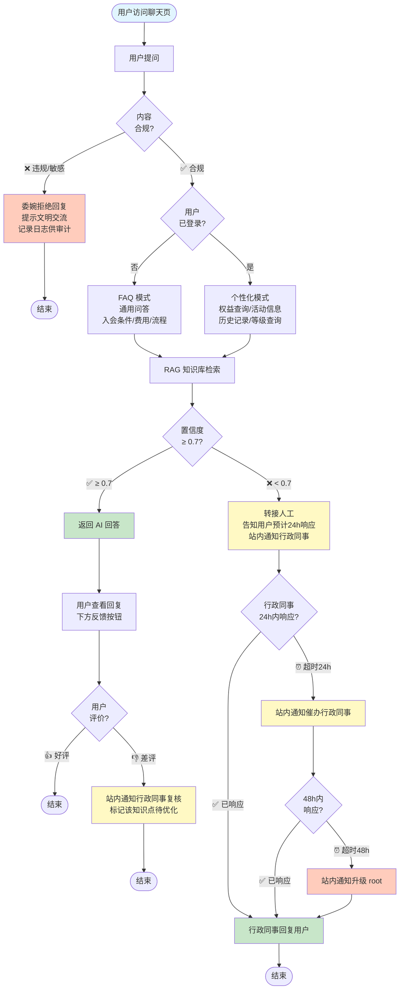

```mermaid
flowchart TD
    Start(["用户访问聊天页"]) --> Ask["用户提问"]
    Ask --> Sensitive{"内容<br/>合规?"}

    Sensitive -->|"❌ 违规/敏感"| Reject["委婉拒绝回复<br/>提示文明交流<br/>记录日志供审计"]
    Reject --> End1(["结束"])

    Sensitive -->|"✅ 合规"| Login{"用户<br/>已登录?"}

    Login -->|"否"| FAQ["FAQ 模式<br/>通用问答<br/>入会条件/费用/流程"]
    Login -->|"是"| Personalized["个性化模式<br/>权益查询/活动信息<br/>历史记录/等级查询"]

    FAQ --> RAG["RAG 知识库检索"]
    Personalized --> RAG

    RAG --> Confidence{"置信度<br/>≥ 0.7?"}

    Confidence -->|"✅ ≥ 0.7"| Answer["返回 AI 回答"]
    Confidence -->|"❌ < 0.7"| Transfer["转接人工<br/>告知用户预计24h响应<br/>站内通知行政同事"]

    Transfer --> ATimeout{"行政同事<br/>24h内响应?"}
    ATimeout -->|"✅ 已响应"| AdminReply["行政同事回复用户"]
    ATimeout -->|"⏰ 超时24h"| Remind["站内通知催办行政同事"]
    Remind --> ATimeout2{"48h内<br/>响应?"}
    ATimeout2 -->|"✅ 已响应"| AdminReply
    ATimeout2 -->|"⏰ 超时48h"| Escalate["站内通知升级 root"]
    Escalate --> AdminReply

    Answer --> Feedback["用户查看回复<br/>下方反馈按钮"]
    Feedback --> FType{"用户<br/>评价?"}
    FType -->|"👍 好评"| End2(["结束"])
    FType -->|"👎 差评"| BadFeedback["站内通知行政同事复核<br/>标记该知识点待优化"]
    BadFeedback --> End3(["结束"])

    AdminReply --> End4(["结束"])

    style Start fill:#e1f5fe
    style Reject fill:#ffccbc
    style Transfer fill:#fff9c4
    style Remind fill:#fff9c4
    style Escalate fill:#ffccbc
    style BadFeedback fill:#fff9c4
    style Answer fill:#c8e6c9
    style AdminReply fill:#c8e6c9
```