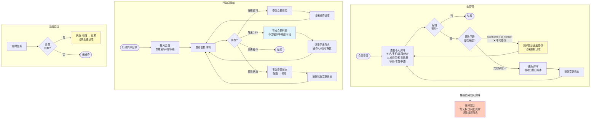

```mermaid
flowchart TD
    subgraph Member ["会员端"]
        MLogin(["会员登录"]) --> MView["查看个人资料<br/>姓名/手机/邮箱/地址<br/>从业经历/相关资质<br/>等级/年费/状态"]
        MView --> Edit{"编辑<br/>资料?"}
        Edit -->|"否"| MEnd(["结束"])
        Edit -->|"是"| CheckField{"修改字段<br/>是否敏感?"}
        CheckField -->|"username / id_number<br/>❌ 不可修改"| Block["友好提示无法修改<br/>记录越权日志"]
        Block --> MView
        CheckField -->|"其他字段 ✅"| MUpdate["更新资料<br/>自动归档旧版本"]
        MUpdate --> MLog["记录变更日志"]
        MLog --> MView
    end

    subgraph Admin ["行政同事端"]
        ALogin(["行政同事登录"]) --> ASearch["搜索会员<br/>按姓名/手机/等级"]
        ASearch --> AView["查看会员详情"]
        AView --> AAction{"操作?"}
        AAction -->|"编辑资料"| AEdit["修改会员信息"]
        AEdit --> ALog1["记录操作日志"]
        AAction -->|"导出CSV"| ACSV["导出会员列表<br/>不含密码等敏感字段"]
        ACSV --> ALog2["记录导出日志<br/>操作人/时间/条数"]
        AAction -->|"修改状态"| AStatus["手动设置状态<br/>在籍 ↔ 停用"]
        AStatus --> ALog3["记录状态变更日志"]
        AAction -->|"无需操作"| AEnd(["结束"])

        ALog1 --> AView
        ALog2 --> AView
        ALog3 --> AView
    end

    subgraph Auto ["系统自动"]
        Cron["定时任务"] --> DuesCheck{"会费<br/>到期?"}
        DuesCheck -->|"是"| Expired["状态: 在籍 → 过期<br/>记录变更日志"]
        DuesCheck -->|"否"| NoOp(["无操作"])
    end

    Member -.->|"越权访问他人资料"| Unauthorized["友好提示<br/>'您无权访问此资源'<br/>记录越权日志"]

    style Unauthorized fill:#ffccbc
    style Block fill:#fff9c4
    style Expired fill:#fff9c4
    style ACSV fill:#e1f5fe
```