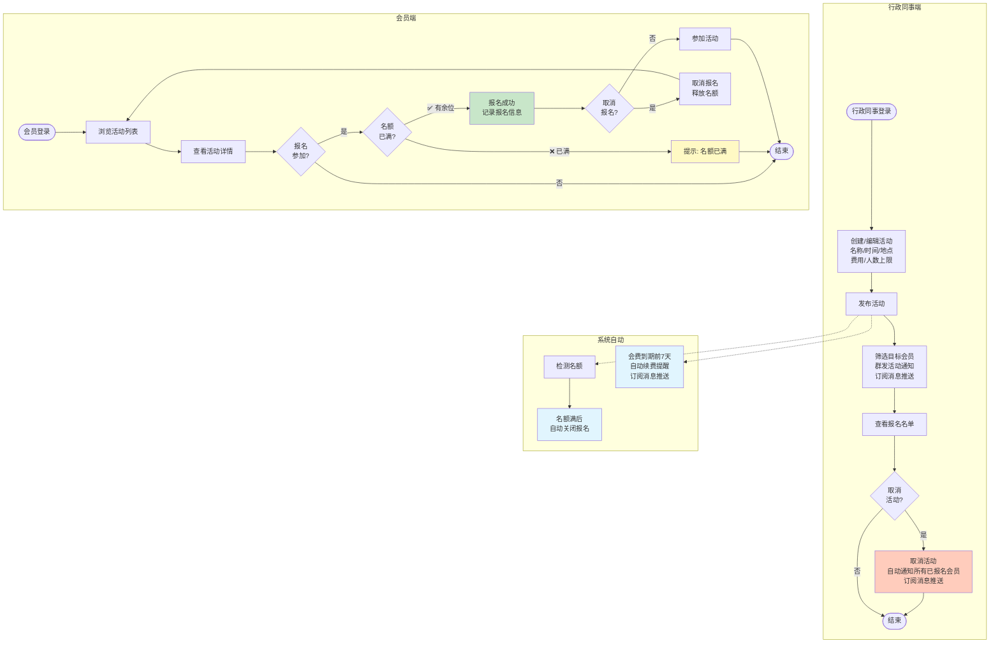

```mermaid
flowchart TD
    subgraph Admin ["行政同事端"]
        ALogin(["行政同事登录"]) --> Create["创建/编辑活动<br/>名称/时间/地点<br/>费用/人数上限"]
        Create --> Publish["发布活动"]
        Publish --> MassNotify["筛选目标会员<br/>群发活动通知<br/>订阅消息推送"]
        MassNotify --> AMonitor["查看报名名单"]
        AMonitor --> ACancel{"取消<br/>活动?"}
        ACancel -->|"是"| CancelEvent["取消活动<br/>自动通知所有已报名会员<br/>订阅消息推送"]
        ACancel -->|"否"| AEnd(["结束"])
        CancelEvent --> AEnd
    end

    subgraph Member ["会员端"]
        MLogin(["会员登录"]) --> Browse["浏览活动列表"]
        Browse --> Detail["查看活动详情"]
        Detail --> MRegister{"报名<br/>参加?"}
        MRegister -->|"是"| Full{"名额<br/>已满?"}
        Full -->|"❌ 已满"| FullMsg["提示: 名额已满"]
        Full -->|"✅ 有余位"| Register["报名成功<br/>记录报名信息"]
        Register --> MCancel{"取消<br/>报名?"}
        MCancel -->|"是"| CancelReg["取消报名<br/>释放名额"]
        MCancel -->|"否"| Attend["参加活动"]
        MRegister -->|"否"| MEnd(["结束"])
        FullMsg --> MEnd
        CancelReg --> Browse
        Attend --> MEnd
    end

    subgraph Auto ["系统自动"]
        FullCheck["检测名额"] --> AutoClose["名额满后<br/>自动关闭报名"]
        DuesRemind["会费到期前7天<br/>自动续费提醒<br/>订阅消息推送"]
    end

    Publish -.-> FullCheck
    Publish -.-> DuesRemind

    style FullMsg fill:#fff9c4
    style CancelEvent fill:#ffccbc
    style AutoClose fill:#e1f5fe
    style DuesRemind fill:#e1f5fe
    style Register fill:#c8e6c9
```