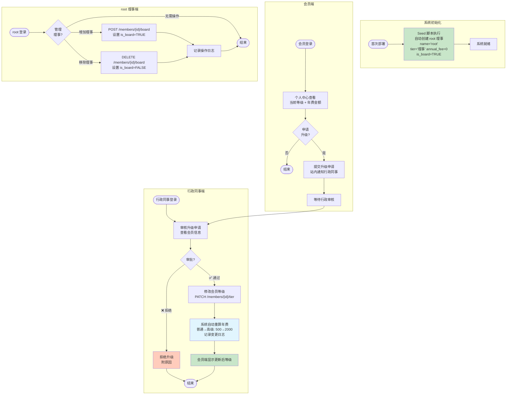

```mermaid
flowchart TD
    subgraph Init ["系统初始化"]
        Deploy(["首次部署"]) --> Seed["Seed 脚本执行<br/>自动创建 root 理事<br/>name='root'<br/>tier='理事' annual_fee=0<br/>is_board=TRUE"]
        Seed --> Ready["系统就绪"]
    end

    subgraph Member ["会员端"]
        MLogin(["会员登录"]) --> MView["个人中心查看<br/>当前等级 + 年费金额"]
        MView --> MUpgrade{"申请<br/>升级?"}
        MUpgrade -->|"否"| MEnd(["结束"])
        MUpgrade -->|"是"| Request["提交升级申请<br/>站内通知行政同事"]
        Request --> Wait["等待行政审核"]
    end

    subgraph Admin ["行政同事端"]
        ALogin(["行政同事登录"]) --> AReview["审核升级申请<br/>查看会员信息"]
        AReview --> ADecision{"审批?"}
        ADecision -->|"✅ 通过"| AUpgrade["修改会员等级<br/>PATCH /members/{id}/tier"]
        ADecision -->|"❌ 拒绝"| AReject["拒绝升级<br/>附原因"]
        AUpgrade --> Calc["系统自动重算年费<br/>普通→高级: 500→2000<br/>记录变更日志"]
        Calc --> Notify["会员端显示更新后等级"]
        AReject --> AEnd(["结束"])
        Notify --> AEnd
    end

    subgraph Root ["root 理事端"]
        RLogin(["root 登录"]) --> RManage{"管理<br/>理事?"}
        RManage -->|"增加理事"| AddBoard["POST /members/{id}/board<br/>设置 is_board=TRUE"]
        RManage -->|"移除理事"| DelBoard["DELETE /members/{id}/board<br/>设置 is_board=FALSE"]
        RManage -->|"无需操作"| REnd(["结束"])
        AddBoard --> RLog["记录操作日志"]
        DelBoard --> RLog
        RLog --> REnd
    end

    Wait --> AReview

    style Seed fill:#c8e6c9
    style Calc fill:#e1f5fe
    style AReject fill:#ffccbc
    style Notify fill:#c8e6c9
```